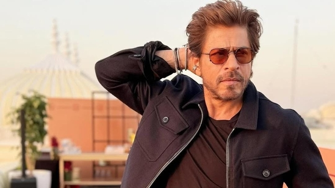
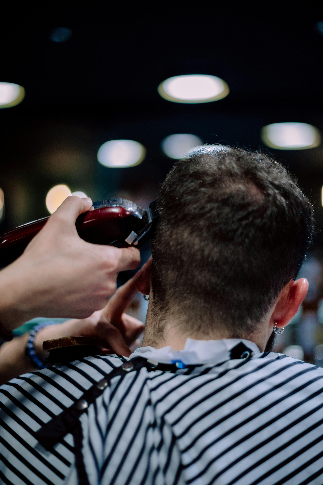
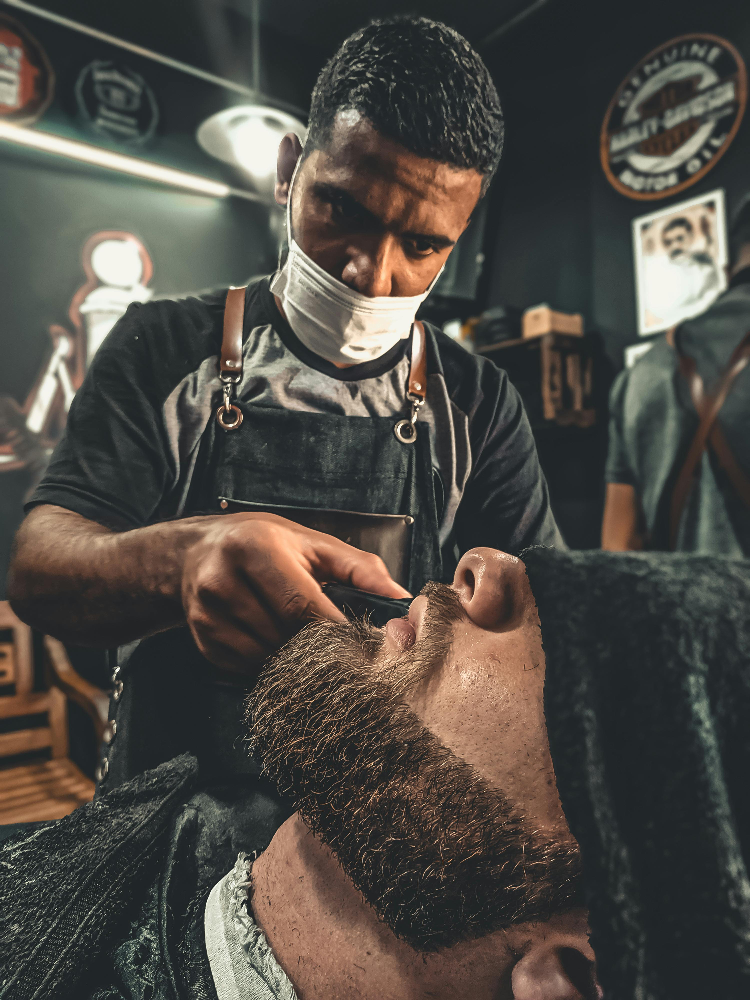
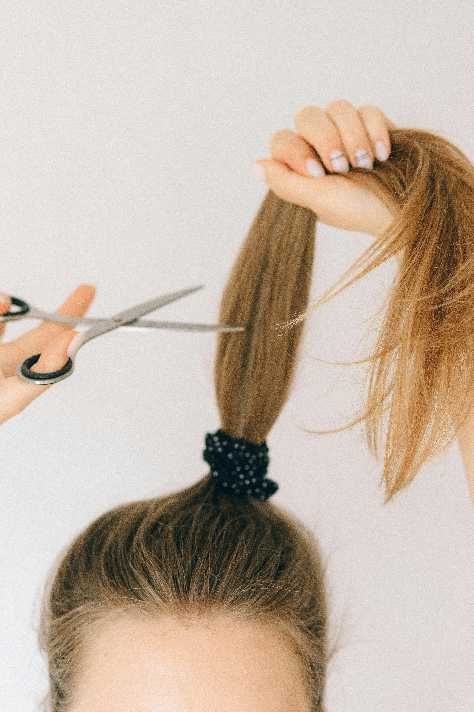
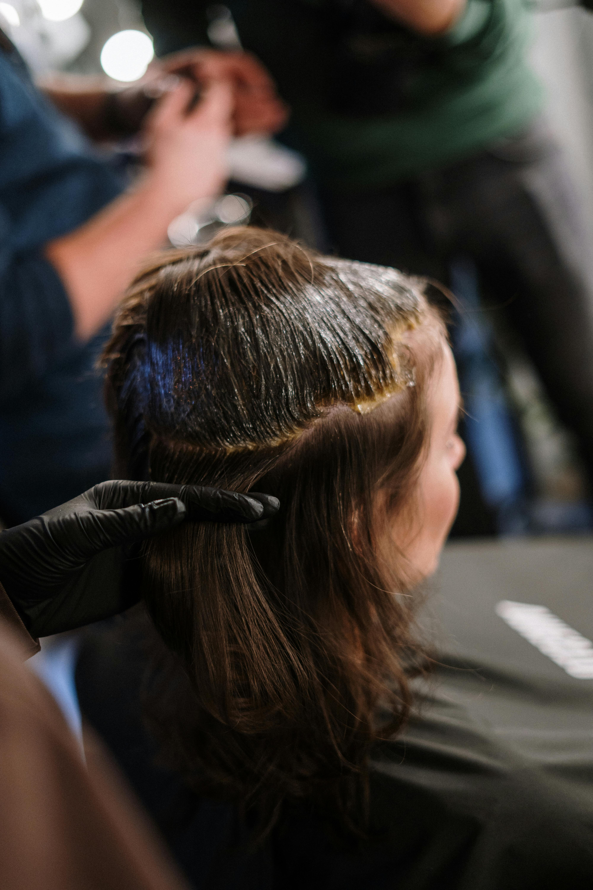
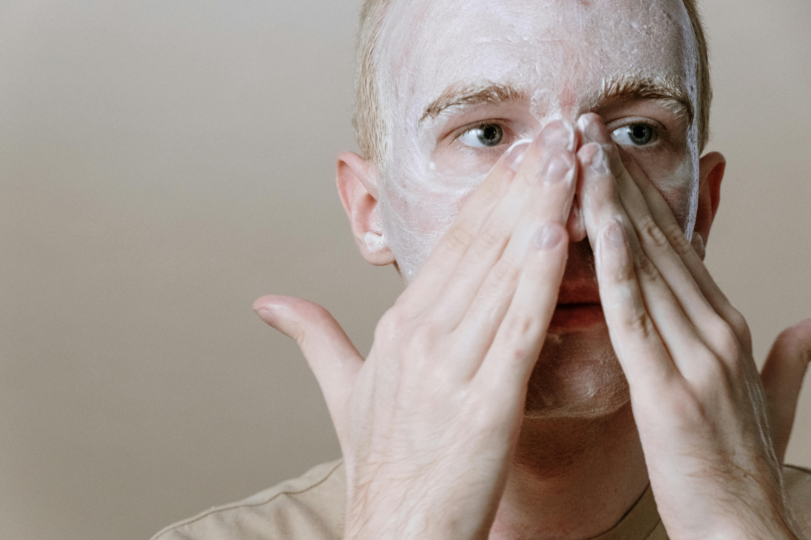
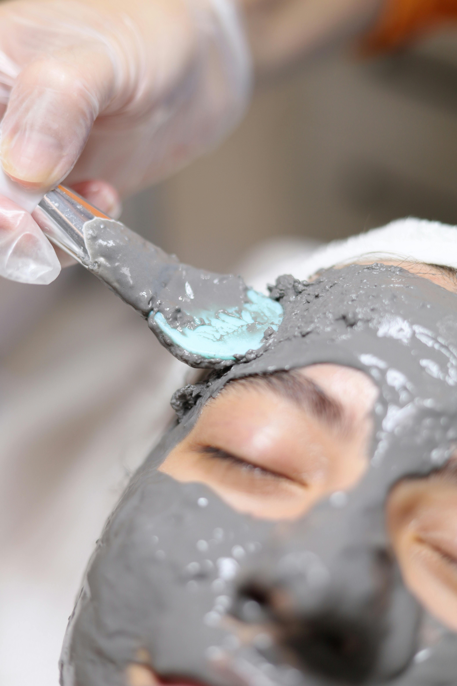

# Good-Luck-Hair-Salon
<html lang="en">
<head>
  <meta charset="UTF-8" />
  <meta name="viewport" content="width=device-width, initial-scale=1.0"/>
  <title>Good Luck Hair Salon</title>
  <link href="https://fonts.googleapis.com/css2?family=Montserrat:wght@400;700&display=swap" rel="stylesheet">
  
</head>
<body>

  <header>
    <nav>
      <h1>Good Luck Hair Salon</h1>
      
☰

      <ul id="menu">
        <li><a href="#home">Home</a></li>
        <li><a href="#services">Services</a></li>
        <li><a href="#about">About Us</a></li>
        <li><a href="#contact">Contact</a></li>
      </ul>
    </nav>
  </header>

  <section id="home" class="tab-section">
    <h2>WELCOME TO GOOD LUCK HAIR SALON</h2>
    
    
"Where Style Meets Royalty – Be the Star You Are!"

    <a href="#contact" class="btn">BOOK YOUR APPOINTMENT</a>
  </section>

  <section id="services" class="tab-section">
    <h2>FEATURED SERVICES</h2>
    

      

        
        <h3>Hair Cut for Men</h3>
        
₹200

      

      

        
        <h3>Hair Colour for Men</h3>
        
₹350

      

      

        
        <h3>Hair and Beard Styling for Men</h3>
        
₹300

      

      

        
        <h3>Hair Cut and Styling for Women</h3>
        
₹400

      

      

        
        <h3>Hair Colour for Women</h3>
        
₹500

      

      

        
        <h3>Skin Care for Men</h3>
        
₹250

      

      

        
        <h3>Skin Care for Women</h3>
        
₹300

      

    

  </section>

  <section id="about" class="tab-section">
    <h2>About Us</h2>
    
Welcome to GOOD LUCK HAIR SALON, where beauty is more than skin deep- it's an experience. From the moment you walk through our doors, you will be greeted with warmth and sophistication. We will give you absolutely the best. Whether you are preparing for a big event or indulging in a little self care. From precision haircuts and luxurious color treatments to facials and skin cares, every service is crafted with passion. Relax in our salon desingned to melt away the stress of the day and leave with glow that is both seen and felt.
    At GOOD LUCK HAIR SALON, we don't just enhance your beauty- we celebrate it. Come discover the difference a truly elevated salon experience can make. Contact us for booking.

  </section>

  <section id="contact" class="tab-section">
    <h2>Contact Us</h2>
    
<strong>Address:</strong> Shop-7, Ganpati Market, Sector-15, Rourkela - 769003, Odisha

    
<strong>Get Directions:</strong> <a href="https://maps.google.com" target="_blank">Google Maps</a>

    
<strong>Phone:</strong> +91-9938646661

  </section>

  <footer>
    
&copy; 2025 Good Luck Hair Salon. All rights reserved.

  </footer>

  
</body>
</html>
